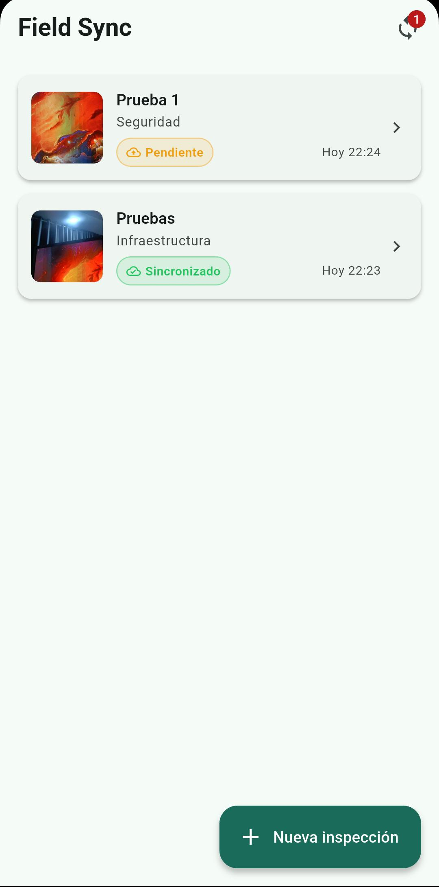
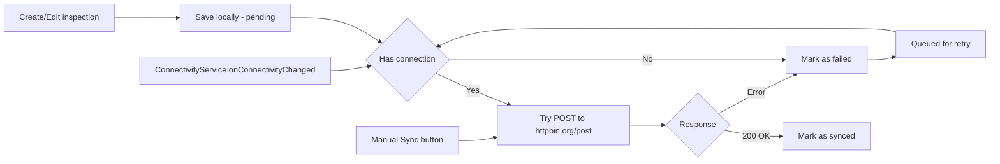

# Field Sync



Mini app de captura offline-first de inspecciones de campo.

---

## Cómo correrlo localmente

**Requisitos:**

- Flutter SDK ≥ 3.12 (canal stable)
- Android device o emulador con API 21+
- Cámara física disponible (la cámara del emulador también funciona)

```bash
flutter pub get
flutter run
```

Tests unitarios:

```bash
flutter test test/sync_queue_test.dart
```

---

## Decisiones técnicas

### State management: Cubit (flutter_bloc)

Elegí **Cubit** sobre BLoC completo porque el flujo de esta app es simple y unidireccional: el usuario crea inspecciones, el cubit las persiste y sincroniza. BLoC agrega una capa de Events que sería boilerplate innecesario aquí. Cubit sigue siendo completamente testeable y predecible.

### Persistencia: Hive

Elegí **Hive** sobre sqflite/Drift porque:

- Sin SQL: las inspecciones son entidades planas, no hay relaciones complejas que justifiquen un ORM.
- Rápido en lecturas: toda la lista se carga de memoria (Box en RAM).
- Sin native setup: Drift/sqflite requieren configuración de FFI en Flutter 3.x; Hive funciona con `hive_flutter` sin pasos adicionales.
- Serialización manual con `toMap/fromMap` evita necesitar `build_runner`.

### Offline-first (sync queue)

El flujo es:

1. Al crear/editar → guardar local con `SyncStatus.pending`.
2. Si hay conexión → intentar `POST` a httpbin.org → marcar `synced` o `failed`.
3. Al recuperar conexión → `ConnectivityService.onConnectivityChanged` dispara `retryPending()` automáticamente.
4. El botón de sync manual en el AppBar (solo visible cuando hay pendientes/fallidos) permite reintentar manualmente.

### Cámara: camera package

Se usa la cámara real del dispositivo con `CameraController`. No se usa `image_picker` para cumplir el requerimiento de cámara real.

### Backend mock: httpbin.org/post

`https://httpbin.org/post` acepta cualquier POST y devuelve 200 con el cuerpo reflejado. No requiere auth ni configuración.

### Bonus implementados

- **Compresión de foto**: `flutter_image_compress` comprime a 75% de calidad y máx 1920px antes de guardar localmente.
- **50% de fallo simulado**: Controlado por `kEnableRandomFailure` en `lib/core/constants.dart`. Por defecto desactivado; al activarlo, la mitad de los syncs fallan y quedan en cola para reintento.

---

## Librerías clave

| Librería | Versión | Uso |
| --- | --- | --- |
| flutter_bloc | ^8.1.6 | State management (Cubit) |
| hive_flutter | ^1.1.0 | Persistencia local |
| camera | ^0.11.0+2 | Cámara real del dispositivo |
| connectivity_plus | ^6.1.1 | Detección de conectividad |
| http | ^1.2.2 | HTTP client (sync con backend) |
| permission_handler | ^11.3.1 | Permisos de cámara en runtime |
| flutter_image_compress | ^2.3.0 | Compresión de foto (bonus) |
| mocktail | ^1.0.4 | Mocking en tests |

---

## Limitaciones detectadas

1. **Sin retry con backoff exponencial**: el reintento automático ocurre cada vez que cambia la conectividad. En producción se añadiría backoff exponencial y un máximo de intentos.

2. **Foto no incluida en el payload al backend**: httpbin.org no procesa multipart de manera útil para este demo. La foto se guarda localmente; en producción se subiría a S3/GCS y se enviaría la URL.

3. **Sin manejo de expiración de fotos**: si el usuario desinstala y reinstala, los paths de fotos quedan obsoletos. Se maneja visualmente con un fallback en la UI.

4. **Orientación de cámara**: en algunos dispositivos Android el preview puede aparecer rotado; limitación conocida del `camera` package.

5. **Sin paginación**: para una colección grande la carga completa de Hive en memoria podría ser un problema. Se resolvería con paginación o lazy loading.

---

## Uso de IA

Se usó Claude Code (Anthropic) para scaffolding inicial, generación de boilerplate (Cubit, pantallas, adapters Hive) y estructura de tests con mocktail.

**Validación:** Se revisó cada archivo generado — lógica de sync, manejo de errores en `SyncService`, lifecycle del `CameraController`, y patrones de `BlocBuilder`. Los tests se ejecutaron y verificaron. Se comprobó que el flujo offline→online dispara correctamente el reintento vía `ConnectivityService.onConnectivityChanged`.

## Diagrama de flujo

Diagrama que ilustra el flujo de sincronización offline-first y la cola de reintentos.


